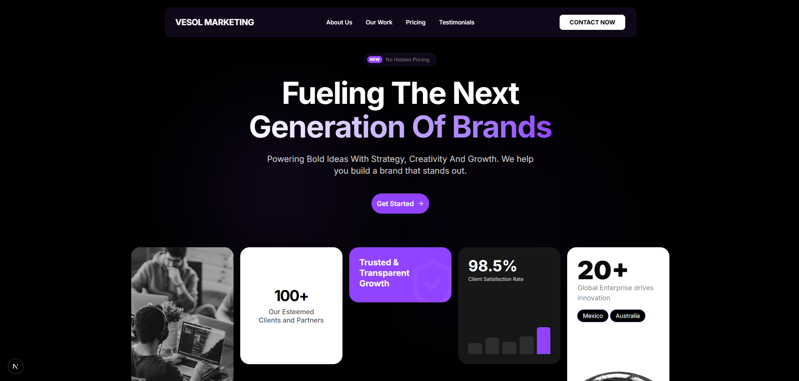

# Vesol Marketing Website

A high-performance, design-forward marketing agency website built with the latest modern web technologies. This project showcases premium design aesthetics, complex animations, and a seamless user experience.


<!-- _(Note: Add a screenshot of the hero section here)_ -->

## 🚀 Tech Stack

- **Framework**: [Next.js 16](https://nextjs.org/) (App Router)
- **Language**: [TypeScript](https://www.typescriptlang.org/)
- **Styling**: [Tailwind CSS v4](https://tailwindcss.com/) (Alpha)
- **Animations**: [Framer Motion](https://www.framer.com/motion/)
- **Icons**: [Lucide React](https://lucide.dev/)
- **Font**: Inter & Playfair Display
- **Layouts**: Masonry Grids, Bento Grids

## ✨ Key Features

- **Modern Design System**: Immersive dark mode, glassmorphism effects, and "OKLCH" color spaces.
- **Pages Implemented**:
  - **Home**: High-impact hero, services overview.
  - **About Us**: agency story, values bento grid, and team roster.
  - **Our Work**: Interactive project gallery with filtering and category switching.
  - **Pricing**: Transparent pricing tiers with monthly/yearly toggles.
  - **Testimonials**: "Wall of Love" masonry grid mixing reviews, tweets, and highlights.
  - **Contact**: Split-screen layout with an interactive inquiry form.
- **Performance**: Optimized for core web vitals and fast transitions.

## 📂 Project Structure

```bash
├── app/
│   ├── about/          # About Us page
│   ├── contact/        # Contact page
│   ├── our-work/       # Portfolio/Work page
│   ├── pricing/        # Pricing & Plans page
│   ├── testimonials/   # Customer success stories
│   ├── components/     # Reusable UI components
│   │   ├── about/      # About-specific components
│   │   ├── contact/    # Contact-specific components
│   │   ├── pricing/    # Pricing-specific components
│   │   ├── testimonials/# Testimonial components
│   │   ├── work/       # Work-specific components
│   │   └── ui/         # Generic UI elements (Buttons, Inputs, etc.)
│   ├── fonts/          # Local font assets
│   ├── globals.css     # Global styles & Tailwind config
│   └── layout.tsx      # Root layout (Navbar, Footer)
└── public/             # Static assets
```

## 🛠️ Getting Started

First, clone the repository and install dependencies:

```bash
git clone https://github.com/KaarimHussain/Marketing-Agency.git
cd Marketing-Agency
npm install
```

Then, run the development server:

```bash
npm run dev
# or
yarn dev
# or
pnpm dev
# or
bun dev
```

Open [http://localhost:3000](http://localhost:3000) with your browser to see the result.

## 🎨 Customization

### Colors

This project uses **OKLCH** color spaces defined in `app/globals.css`. You can adjust the `primary`, `secondary`, and `muted` variables to change the brand theme globally.

### Animations

Animations are handled by `framer-motion`. Check individual components (like `PricingPlans.tsx` or `ReviewsGrid.tsx`) to tweak entrance effects and transitions.

## 📜 License

© 2025 Vesol Marketing. All rights reserved.
Design & Developed by Vesol Marketing.
